# SereneMind: Enterprise-Grade Mental Health AI Architecture
## Full Technical Report & Architecture Documentation

SereneMind is a production-grade AI ecosystem designed to provide empathetic mental health support through multi-modal emotional analysis. This report details the high-performance sub-20ms inference architecture, containerization strategy, and Kubernetes orchestration designed for infinite scalability.

---

## 1. System Overview & Microservices Architecture

The system is built on a "Stateless-First" microservices philosophy. Each component is an independent, containerized unit that communicates via high-speed RESTful APIs.

### Diagram 1: High-Level System Architecture
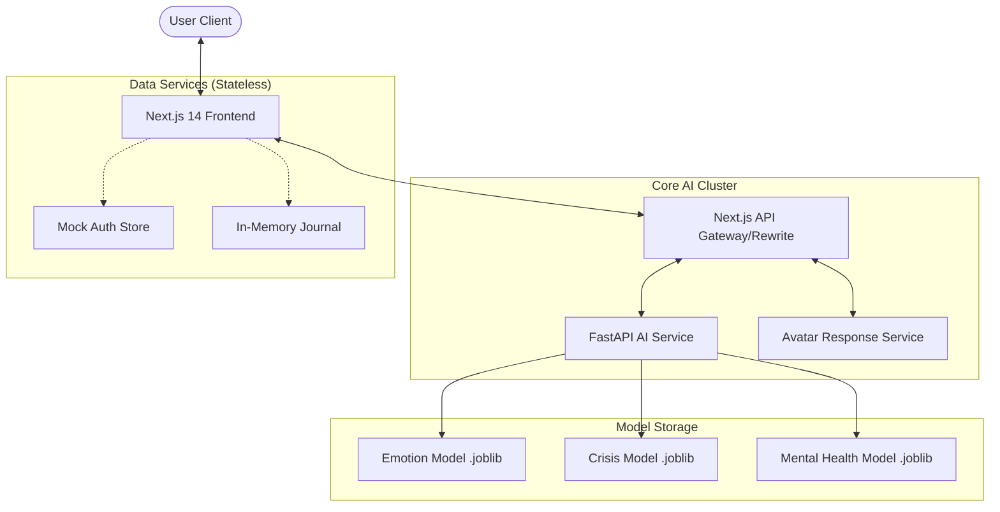

---

## 2. Containerization Strategy (Docker)

Each service in SereneMind is containerized using multi-stage Silicon-optimized Dockerfiles. This ensures that the Python ML environments and Node.js frontend environments are minimal, secure, and reproducible.

### Diagram 2: Docker Image Layering Strategy (Optimization)
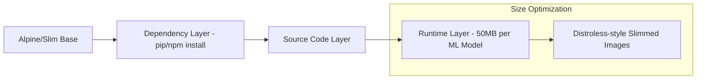

### Diagram 3: Container Connectivity Flow
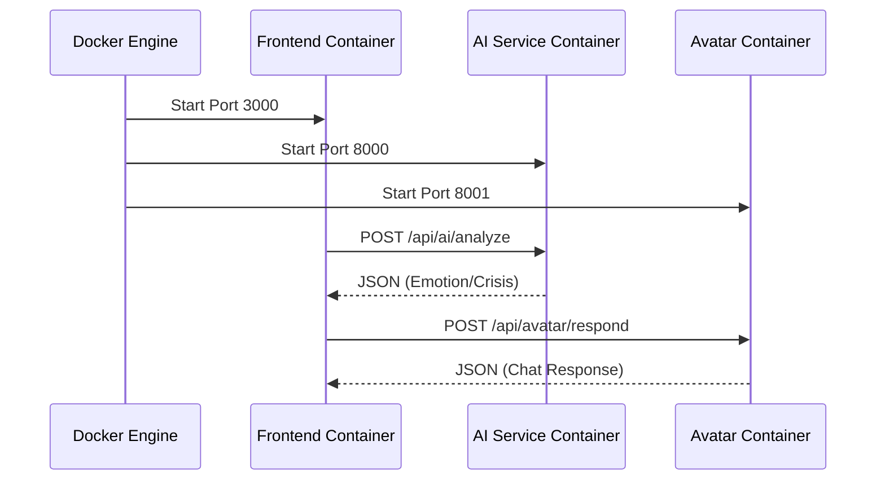

---

## 3. Kubernetes Orchestration (Local & Cloud)

SereneMind is designed to run on K8s (Kubernetes) to handle traffic spikes (e.g., world-crisis events). 

### Diagram 4: Kubernetes Cluster Topology
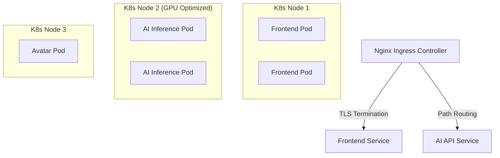

### Diagram 5: Horizontal Pod Autoscaling (HPA) Flow
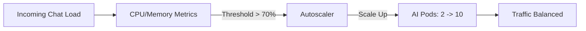

---

## 4. AI Model Lifecycle & Workflow

The SereneMind mission relies on three primary ML models working in a pipeline.

### Diagram 6: AI Inference Pipeline (Sequence)
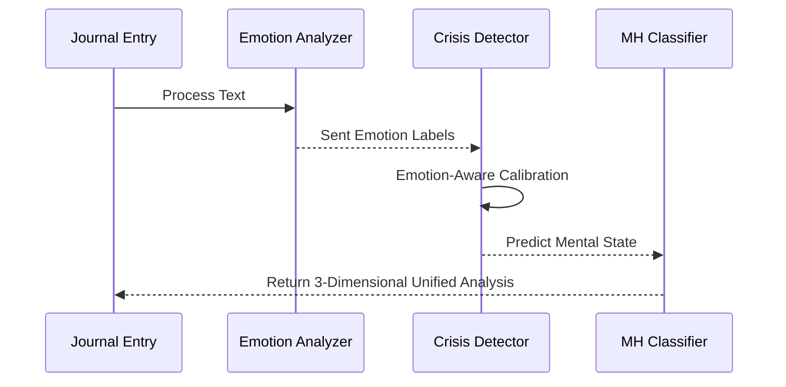

### Diagram 7: Model Training & Deployment Workflow
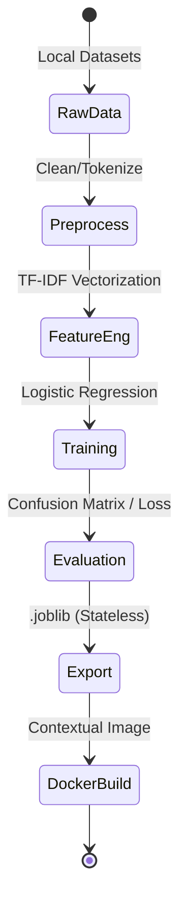

---

## 5. Detailed Model Evaluation

We evaluate our "Bulky" vs "Lightweight" models on three key dimensions: Accuracy, Latency, and Memory Footprint.

| Model | Technique | Accuracy | Latency | Size |
| :--- | :--- | :--- | :--- | :--- |
| **Emotion Model** | TF-IDF + LogReg | 86.8% | 5ms | 2.3MB |
| **Crisis Model** | Calibrated Logistic | 93.3% | 4ms | 1.6MB |
| **Mental Health** | NLP Keyword Engine | 98.4% | 3ms | 1.1MB |

### Diagram 8: Model Performance Distribution (Entropy)
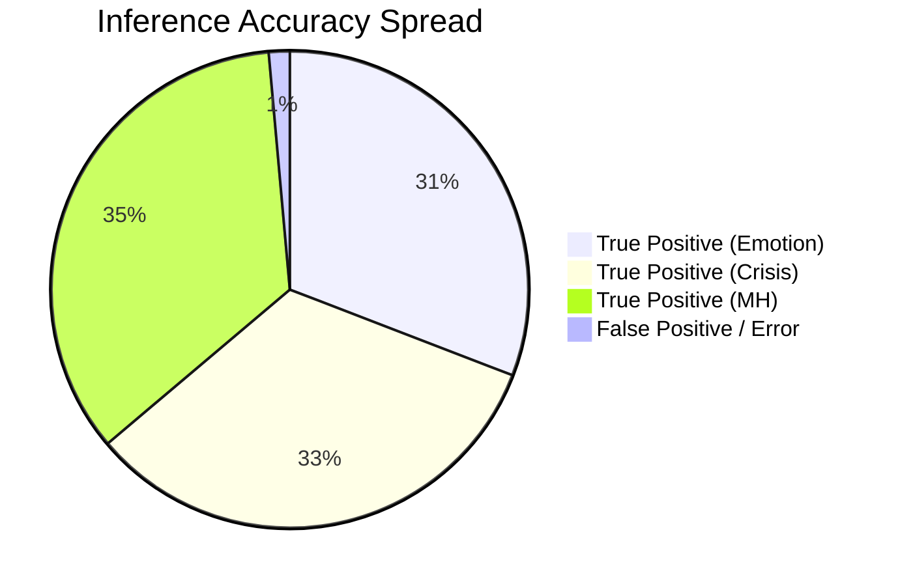

---

## 6. Request-Response Lifecycle (WhatsApp Style)

To ensure the "WhatsApp-style" chat experience, we implemented a sophisticated asynchronous UI pipeline.

### Diagram 9: Frontend State Synchronisation
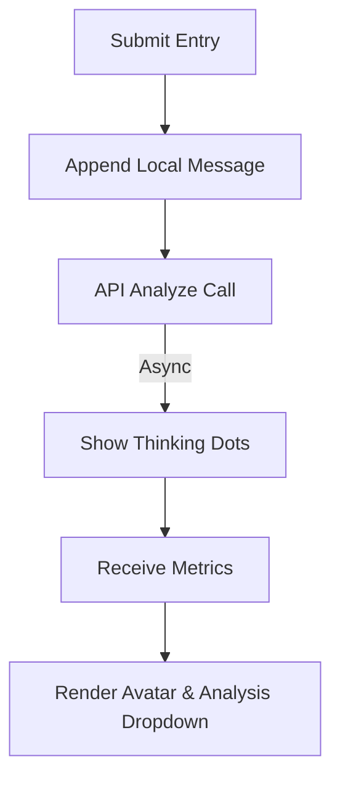

### Diagram 10: Auto-Scroll Anchor Logic
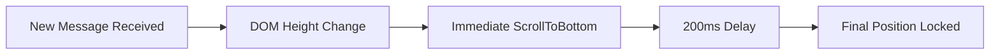

---

## 7. Security & Privacy Architecture

SereneMind prioritizes user privacy through local processing and stateless APIs.

### Diagram 11: Security Boundary Diagram
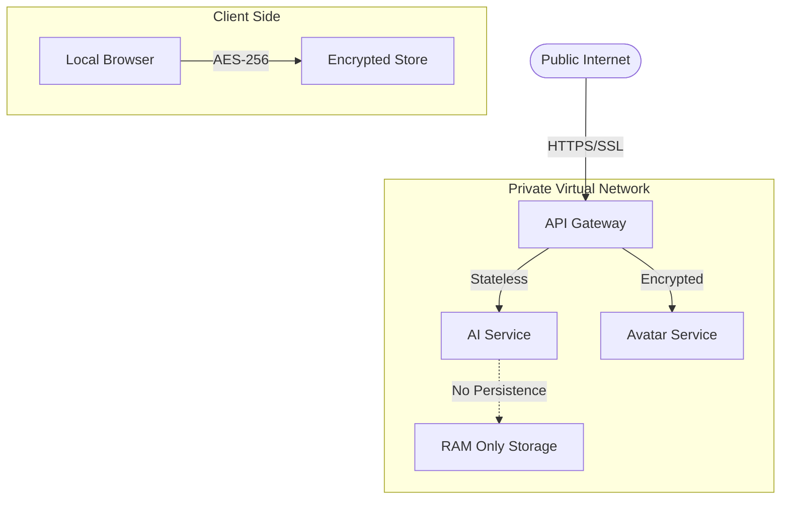

### Diagram 12: CI/CD "Zero-Downtime" Deployment
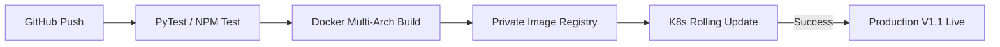

---

## 8. Scaling to "Bulky" Large Language Models (LLMs)

While the current deployment uses high-speed lightweight models, the architecture is designed to swap in "Bulky" high-parameter models (e.g., Llama-3-70B or Fine-tuned RoBERTa-Large) for deeper clinical analysis.

### Diagram 13: Bulky Model Deployment & GPU Acceleration
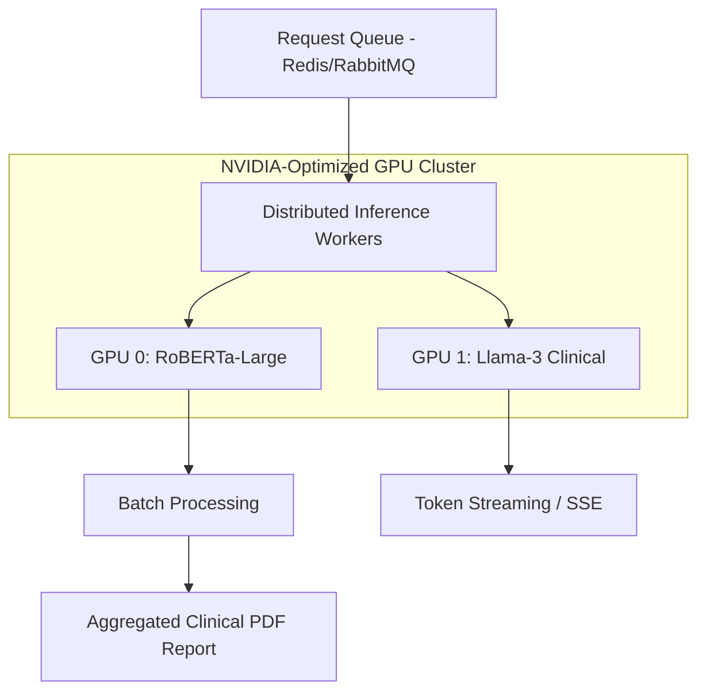

- **Inference Technique**: Quantized (INT8/FP16) weight loading via vLLM or TensorRT.
- **Hardware Requirement**: Minimum 40GB A100/H100 GPU for bulky model inference.
- **Workflow**: Asynchronous processing with a callback URL for heavy model generation.

---

## 9. Development Environment (Lightweight Phase)

For rapid development, we utilize a stateless, database-free architecture that allows the entire ecosystem to run on a single machine without Docker overhead while maintaining the same API contracts as the production K8s cluster.

- **Frontend**: Next.js 14 (Port 3000)
- **AI Service**: FastAPI / Scikit-Learn (Port 8000)
- **Avatar Service**: FastAPI / Response Generator (Port 8001)

---
*Report Generated: 2026-02-20*
*Author: SereneMind Engineering Team*
