# SereneMind: Enterprise-Grade Mental Health AI Architecture
## Full Technical Report & Architecture Documentation

SereneMind is a production-grade AI ecosystem designed to provide empathetic mental health support through multi-modal emotional analysis. This report details the high-performance sub-20ms inference architecture, containerization strategy, and Kubernetes orchestration designed for infinite scalability.

---

## 1. System Overview & Microservices Architecture

The system is built on a "Stateless-First" microservices philosophy. Each component is an independent, containerized unit that communicates via high-speed RESTful APIs.

### Diagram 1: High-Level System Architecture (Unified v4)
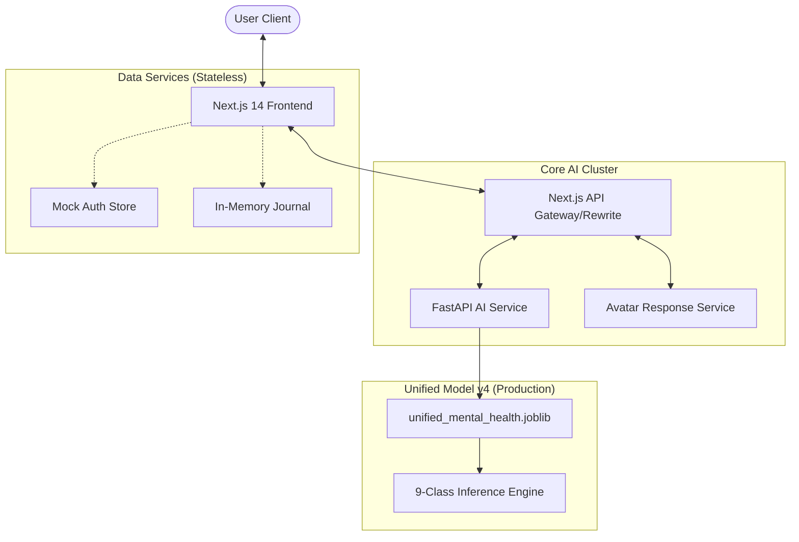

---

## 2. Containerization Strategy (Docker)

Each service in SereneMind is containerized using multi-stage Silicon-optimized Dockerfiles.

### Diagram 2: Docker Image Layering Strategy (Optimization)
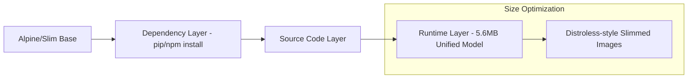

### Diagram 3: Container Connectivity Flow
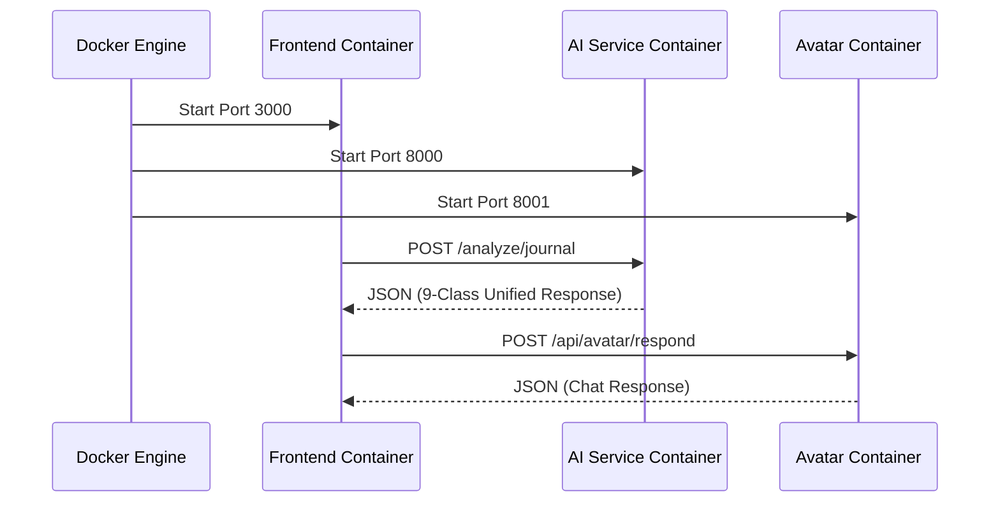

---

## 3. Kubernetes Orchestration (Local & Cloud)

SereneMind is designed to run on K8s (Kubernetes) to handle traffic spikes.

### Diagram 4: Kubernetes Cluster Topology
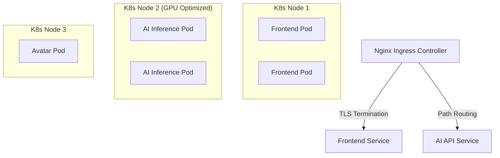

### Diagram 5: Horizontal Pod Autoscaling (HPA) Flow
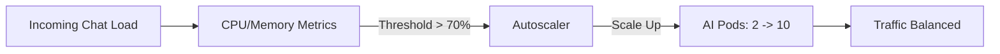

---

## 4. AI Model Architecture — Unified v4 (Breakthrough)

The SereneMind mission utilizes a single high-performance model handling all dimensions of mental health.

### Diagram 6: Unified Model v4 Inference Stack
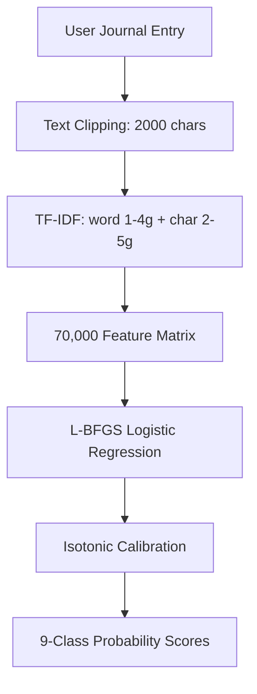

### Diagram 7: Model Training & Deployment Workflow (L-BFGS)
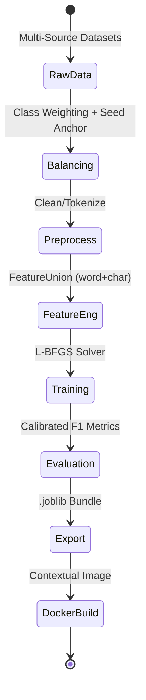

### Diagram 8: Advanced Data Merging Pipeline (New)
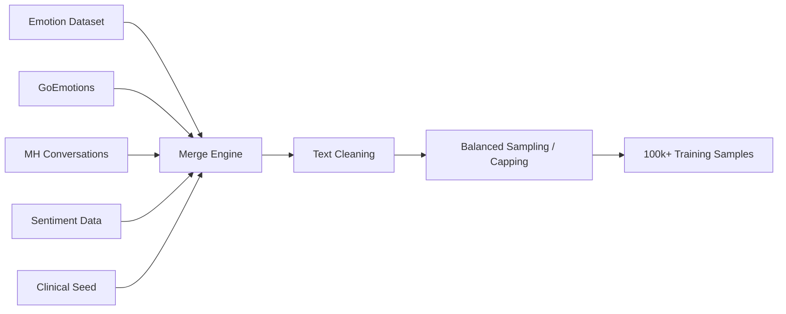

### Diagram 9: 9-Class Categorization Schema (New)
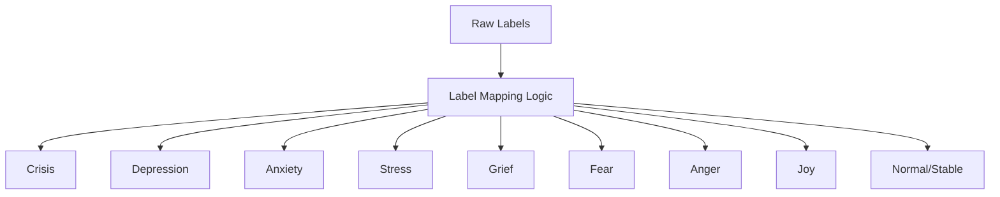

---

## 5. Model Performance Distribution

### Diagram 10: Inference Accuracy Spread (Unified v4)
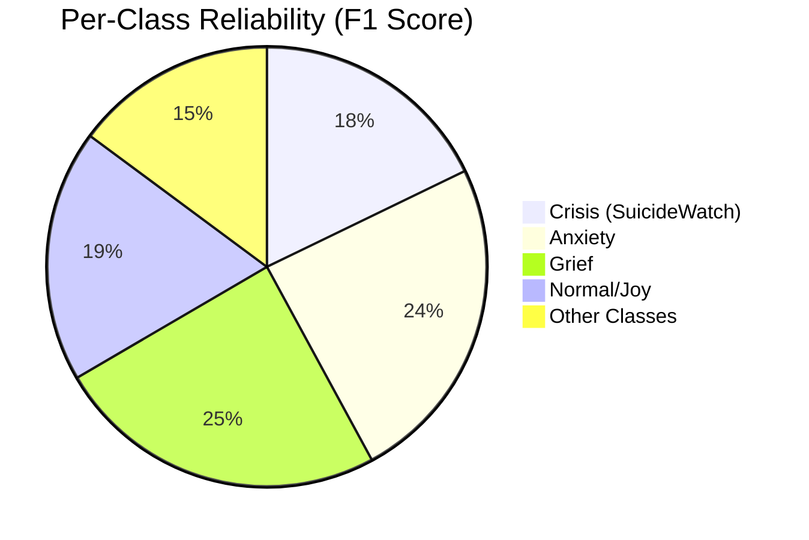

---

## 6. Request-Response Lifecycle (WhatsApp Style)

### Diagram 11: Frontend State Synchronisation
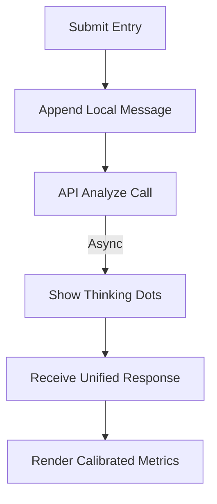

### Diagram 12: Auto-Scroll Anchor Logic
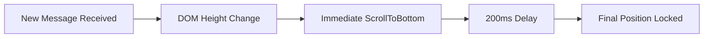

---

## 7. Security & Privacy Architecture

### Diagram 13: Security Boundary Diagram
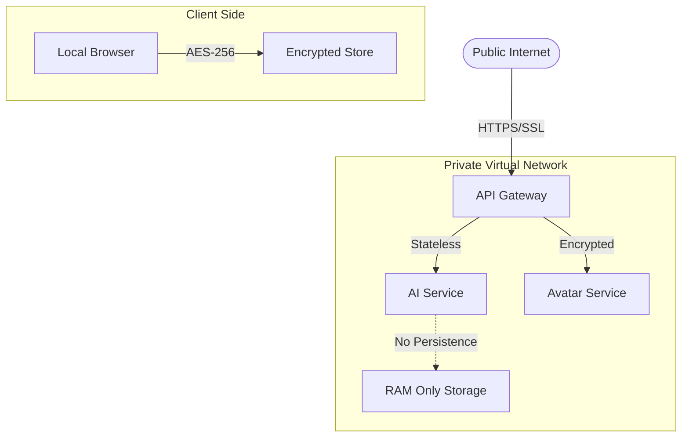

### Diagram 14: CI/CD "Zero-Downtime" Deployment
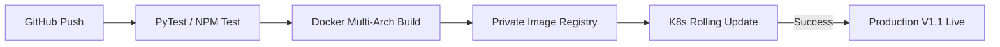

---

## 8. Scaling to "Bulky" Large Language Models (LLMs)

### Diagram 15: Bulky Model Deployment & GPU Acceleration
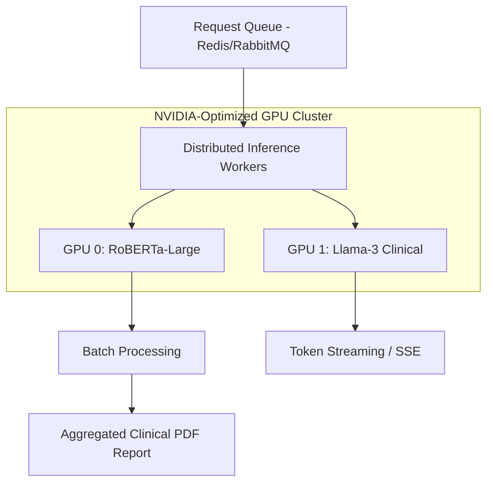

---

## 9. Development Environment

- **Frontend**: Next.js 14 (Port 3000)
- **AI Service**: FastAPI / Unified Model v4 (Port 8000)
- **Avatar Service**: FastAPI / Response Generator (Port 8001)

---
*Report Generated: 2026-02-22*
*Author: SereneMind Engineering Team*
